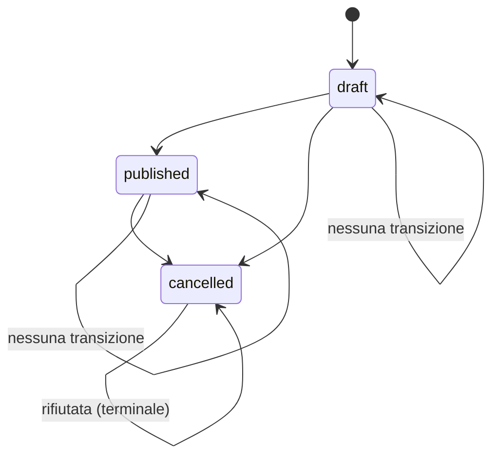

# Design — event-service

**Servizio:** `event-service`
**Contratto di riferimento:** `contracts/openapi/event-service.yaml`
**Requirements:** `.kiro/specs/event-service/requirements.md`
**Regole di struttura e piattaforma:** `.kiro/steering/structure.md`, `.kiro/steering/platform-standards.md`, `.kiro/steering/tech.md`

---

## Overview

`event-service` gestisce l'anagrafica delle conferenze di TechConf e il loro ciclo di
vita (`draft` → `published` → `cancelled`). A differenza di `user-service`,
`event-service` **dipende** da `user-service`: prima di creare o modificare un evento
deve verificare via HTTP che l'`organizer_id` indicato esista e abbia ruolo
`organizer`. Questa dipendenza è l'unica differenza architetturale rilevante rispetto a
`user-service` — introduce un livello `clients/` assente nel servizio anagrafica.

Il servizio espone una REST API JSON su `/api/v1/events` e un health check su
`/health`, sempre raggiungibile anche quando `user-service` non è disponibile
(REQ-EVT-F05). Supporta gli stessi tre backend di persistenza intercambiabili
(`memory`, `json`, `sqlite`) di `user-service`, selezionati a runtime via
`STORAGE_BACKEND`, senza che il cambio di backend richieda modifiche a `domain/`
(REQ-EVT-F07).

---

## Architecture

Il servizio è organizzato in cinque livelli indipendenti (i primi quattro coincidono
con lo schema di `user-service`; il quinto, `clients/`, è specifico di `event-service`
perché deve chiamare un altro servizio):

```
HTTP request
     │
     ▼
┌─────────────────────────────────────────┐
│  api/  (Flask Blueprint)                │  ← parsing, routing, mapping errori→HTTP
│  events.py · errors.py                  │
└────────────────┬────────────────────────┘
                 │ chiama
                 ▼
┌─────────────────────────────────────────┐
│  domain/  (business logic pura)         │  ← regole REQ-EVT-B*, validazione, paginazione,
│  event_service.py · models.py           │    state machine di status
└──────┬──────────────────────┬───────────┘
       │ dipende da            │ dipende da interfaccia
       ▼                       ▼
┌───────────────────┐  ┌─────────────────────────────────────────┐
│  clients/         │  │  repository/  (persistenza)             │  ← memory · json · sqlite
│  user_client.py    │  │  base.py · memory.py · json_repo.py     │
│  (HTTP→user-svc)   │  │  sqlite_repo.py · __init__.py (factory) │
└───────────────────┘  └─────────────────────────────────────────┘

┌─────────────────────────────────────────┐
│  config.py  (configurazione)            │  ← unico punto di lettura env var
└─────────────────────────────────────────┘
```

`domain/event_service.py` non importa `requests` direttamente: riceve `user_client`
iniettato dal costruttore, esattamente come riceve il `repository`. Questo permette di
mockare `user_client` nei test di dominio e di mockare le chiamate HTTP a basso livello
(via `responses`) nei test che esercitano `clients/user_client.py` direttamente.

Struttura cartelle del servizio (conforme a `structure.md`):

```
services/event-service/
├── app/
│   ├── __main__.py          # entry point: legge PORT, crea l'app Flask, avvia il server
│   ├── config.py            # legge PORT, USER_SERVICE_URL, STORAGE_BACKEND, DATA_DIR una sola volta
│   ├── api/
│   │   ├── __init__.py
│   │   ├── events.py        # Blueprint Flask con tutte le route
│   │   └── errors.py        # helper error_response(code, message, status, details)
│   ├── domain/
│   │   ├── __init__.py
│   │   ├── models.py        # dataclass Event + to_dict / from_dict
│   │   └── event_service.py # EventService + eccezioni di dominio + state machine status
│   ├── clients/
│   │   ├── __init__.py
│   │   └── user_client.py   # wraps GET /api/v1/users/{id} verso user-service
│   └── repository/
│       ├── __init__.py      # factory get_repository(backend, data_dir)
│       ├── base.py          # ABC EventRepository
│       ├── memory.py        # MemoryEventRepository
│       ├── json_repo.py     # JsonEventRepository
│       └── sqlite_repo.py   # SqliteEventRepository
├── tests/
│   ├── unit/
│   │   ├── conftest.py
│   │   ├── test_domain.py
│   │   ├── test_user_client.py
│   │   ├── test_api_events.py
│   │   └── test_repository.py
│   └── integration/
│       └── test_integration.py   # avvia un user-service reale come sottoprocesso
└── requirements.txt
```

---

## Components and Interfaces

### `app/config.py`

Unico punto di lettura delle variabili d'ambiente. Espone costanti già risolte
importate da tutti gli altri moduli. `PORT` è obbligatorio e causa un errore
esplicito se assente o fuori range (REQ-EVT-F08).

```python
PORT               = int(os.environ["PORT"])                              # obbligatorio, 1-65535
USER_SERVICE_URL   = os.environ.get("USER_SERVICE_URL", "http://localhost:5001")
STORAGE_BACKEND    = os.environ.get("STORAGE_BACKEND", "memory")          # memory | json | sqlite
DATA_DIR           = os.environ.get("DATA_DIR", "./data")
USER_SERVICE_TIMEOUT = 2  # secondi, mai configurabile via env (fisso da platform-standards.md)
```

### `app/domain/models.py`

`Event` è un dataclass Python puro senza dipendenze da Flask, dal repository o dal
client HTTP.

- `Event.create(data: dict) -> Event` — genera `id` (UUID v4), `created_at`,
  `updated_at`, applica default `status = draft` (REQ-EVT-F10), normalizza
  `description` assente in `None` (REQ-EVT-F03).
- `event.to_dict() -> dict` — serializzazione JSON con date in formato `YYYY-MM-DD` e
  timestamp ISO 8601 UTC.
- `Event.from_dict(d: dict) -> Event` — deserializzazione dal backend.

### `app/domain/event_service.py`

Logica di business iniettata con `repository` e `user_client` via costruttore. Non
importa Flask né `os.environ`; non chiama `requests` direttamente (passa sempre per
`user_client`).

```python
class EventService:
    def __init__(self, repository: EventRepository, user_client: UserClient): ...
```

| Metodo | Requisiti | Descrizione |
|---|---|---|
| `create_event(data)` | REQ-EVT-01, F01-F03, F10, B01-B03 | valida campi, valida organizzatore via `user_client`, verifica `end_date >= start_date`, crea e persiste |
| `get_event(id)` | REQ-EVT-02 | recupera per id; solleva `NotFound` se assente o `id` non UUID valido |
| `list_events(page, page_size, status, city)` | REQ-EVT-03, B06 | filtra (AND su `status`/`city`) e pagina |
| `replace_event(id, data)` | REQ-EVT-04, F01-F03, F10, B01-B04 | sostituisce tutti i campi editabili, valida organizzatore solo se `organizer_id` cambia, applica la state machine di `status` |
| `update_event(id, data)` | REQ-EVT-05, F01-F03, F10, B01-B04 | aggiorna solo i campi presenti, stesse regole di PUT su organizzatore/status/date |
| `delete_event(id)` | REQ-EVT-06 | rimuove; solleva `NotFound` se assente |

La validazione dell'organizzatore (`_validate_organizer`) è invocata da
`create_event` sempre, e da `replace_event`/`update_event` **solo quando
`organizer_id` è presente nel payload e differisce dal valore correntemente
salvato** (REQ-EVT-B01 AC3): evita una chiamata HTTP superflua a `user-service` quando
l'organizzatore non cambia.

**Eccezioni di dominio** (catturate nelle route, mai propagate a Flask):

| Eccezione | Status | Code |
|---|---|---|
| `ValidationError(field, message)` | 422 | `VALIDATION_ERROR` |
| `ReferenceNotFound(field, value)` | 422 | `REFERENCE_NOT_FOUND` |
| `InvalidOrganizer(organizer_id, role)` | 422 | `INVALID_ORGANIZER` |
| `InvalidStatusTransition(current, requested)` | 422 | `INVALID_STATUS_TRANSITION` |
| `DependencyUnavailable(service_name)` | 503 | `DEPENDENCY_UNAVAILABLE` |
| `NotFound` | 404 | `NOT_FOUND` |

### State machine di `status` (REQ-EVT-B04)



Implementata come una funzione pura in `domain/event_service.py`:

```python
_ALLOWED_TRANSITIONS = {
    ("draft", "published"),
    ("draft", "cancelled"),
    ("published", "cancelled"),
}

def _check_transition(current: str, requested: str) -> None:
    if current == requested:
        return  # nessuna transizione, sempre accettato
    if (current, requested) not in _ALLOWED_TRANSITIONS:
        raise InvalidStatusTransition(current, requested)
```

`cancelled` è terminale: qualunque `(cancelled, X)` con `X != cancelled` non è in
`_ALLOWED_TRANSITIONS` e viene quindi sempre rifiutata.

### `app/clients/user_client.py`

Unico punto del servizio che chiama `requests` verso `user-service`. Incapsula URL,
timeout e traduzione degli esiti in eccezioni di dominio, così che `domain/` non
conosca i dettagli HTTP e i test di dominio possano iniettare uno stub.

```python
class UserClient:
    def __init__(self, base_url: str, timeout: float = 2.0):
        self._base_url = base_url
        self._timeout = timeout

    def get_organizer(self, organizer_id: str) -> dict:
        """Ritorna il dict utente se esiste ed è raggiungibile.

        Solleva:
          ReferenceNotFound  — user-service risponde 404
          DependencyUnavailable — timeout, connessione rifiutata, o 5xx
        Non valida il ruolo: la verifica `role == organizer` resta in domain/
        (REQ-EVT-B02), così la regola di business è testabile senza rifare il mock HTTP.
        """
        try:
            resp = requests.get(
                f"{self._base_url}/api/v1/users/{organizer_id}",
                timeout=self._timeout,
            )
        except (requests.Timeout, requests.ConnectionError):
            raise DependencyUnavailable("user-service")

        if resp.status_code == 404:
            raise ReferenceNotFound("organizer_id", organizer_id)
        if 500 <= resp.status_code < 600:
            raise DependencyUnavailable("user-service")
        return resp.json()
```

`EventService._validate_organizer` chiama `user_client.get_organizer(organizer_id)` e
poi verifica `user["role"] == "organizer"`, sollevando `InvalidOrganizer` in caso
contrario (REQ-EVT-B02). In questo modo `user_client.py` è responsabile solo della
traduzione degli esiti HTTP/di rete (REQ-EVT-B01 AC4, REQ-EVT-B05), mai della regola di
ruolo.

Nei test unitari (`tests/unit/test_user_client.py` e `test_domain.py`), le chiamate
HTTP verso `user-service` sono mockate con la libreria `responses` (vedi
`tech.md`), così l'intera suite unitaria è eseguibile senza avviare `user-service`.

### `app/api/events.py`

Blueprint Flask. Ogni route:
1. Parsa il corpo JSON — body assente o non valido → 400 `MALFORMED_JSON`
   (REQ-EVT-F04), valutato **prima** della validazione di campo.
2. Chiama il metodo corrispondente di `EventService`.
3. Cattura le eccezioni di dominio e le mappa al codice HTTP + formato errore standard
   (REQ-EVT-F06).
4. Ritorna `jsonify(event.to_dict()), 201/200/204`.

Mapping route → dominio:

| Metodo HTTP | Path | Metodo `EventService` |
|---|---|---|
| POST | `/api/v1/events` | `create_event` |
| GET | `/api/v1/events` | `list_events` |
| GET | `/api/v1/events/<id>` | `get_event` |
| PUT | `/api/v1/events/<id>` | `replace_event` |
| PATCH | `/api/v1/events/<id>` | `update_event` |
| DELETE | `/api/v1/events/<id>` | `delete_event` |
| GET | `/health` | risposta inline `{"status": "ok", "service": "event-service"}` |

### `app/api/errors.py`

Identico per struttura a `user-service`:

```python
def error_response(code: str, message: str, status: int, details: dict = None) -> Response
```

Costruisce il body standard `{"error": {"code": ..., "message": ..., "details": ...}}`
e ritorna un oggetto `Response` Flask con `Content-Type: application/json`.

### `app/repository/base.py` — `EventRepository` (ABC)

```python
class EventRepository(ABC):
    def save(self, event: Event) -> None: ...
    def find_by_id(self, id: str) -> Event | None: ...
    def list(self, status: str | None, city: str | None) -> list[Event]: ...
    def delete(self, id: str) -> bool: ...   # False se non esiste
```

Il filtro `city` applica confronto case-insensitive (REQ-EVT-B06 AC2) direttamente
nell'implementazione del repository (non in `domain/`), così ogni backend è
responsabile della propria strategia di confronto ma il contratto osservabile resta
identico tra i tre.

### `MemoryEventRepository`

Dizionario `dict[str, Event]` in-process. Nessuna dipendenza esterna.

### `JsonEventRepository`

Legge/scrive `{DATA_DIR}/events.json`. Il file contiene `{"events": [...]}`. Ogni
scrittura ricarica e riscrive l'intero file. Crea `DATA_DIR` se non esiste
(REQ-EVT-F07 AC5).

### `SqliteEventRepository`

Database `{DATA_DIR}/events.db` con schema creato al primo avvio. Solo `sqlite3` dalla
libreria standard.

```sql
CREATE TABLE IF NOT EXISTS events (
    id            TEXT PRIMARY KEY,
    title         TEXT NOT NULL,
    description   TEXT,
    organizer_id  TEXT NOT NULL,
    venue         TEXT NOT NULL,
    city          TEXT NOT NULL,
    start_date    TEXT NOT NULL,
    end_date      TEXT NOT NULL,
    capacity      INTEGER NOT NULL,
    price         TEXT NOT NULL,     -- memorizzato come stringa a 2 decimali per evitare arrotondamenti float
    status        TEXT NOT NULL DEFAULT 'draft',
    created_at    TEXT NOT NULL,
    updated_at    TEXT NOT NULL
);
```

### Factory `repository/__init__.py`

```python
def get_repository(backend: str, data_dir: str) -> EventRepository:
    if backend == "json":   return JsonEventRepository(data_dir)
    if backend == "sqlite": return SqliteEventRepository(data_dir)
    return MemoryEventRepository()
```

Invocata una sola volta in `__main__.py`; il risultato, insieme a un'istanza di
`UserClient(USER_SERVICE_URL)`, viene iniettato in `EventService`.

---

## Data Models

### `Event` (dataclass)

| Campo | Tipo Python | Note |
|---|---|---|
| `id` | `str` (UUID v4) | generato dal server con `uuid.uuid4()` |
| `title` | `str` | 3–120 caratteri |
| `description` | `str \| None` | max 2000 caratteri; `None` se assente o esplicitamente `null` |
| `organizer_id` | `str` (UUID v4) | validato via `user_client` prima della persistenza |
| `venue` | `str` | max 100 caratteri |
| `city` | `str` | max 60 caratteri |
| `start_date` | `date` | formato `YYYY-MM-DD` |
| `end_date` | `date` | formato `YYYY-MM-DD`; `>= start_date` |
| `capacity` | `int` | 1–10000 |
| `price` | `Decimal` | `>= 0.00`, 2 decimali, valuta implicita EUR |
| `status` | `str` | `draft` \| `published` \| `cancelled`; default `draft` |
| `created_at` | `datetime` (UTC) | immutabile dopo la creazione |
| `updated_at` | `datetime` (UTC) | aggiornato ad ogni modifica |

`price` è gestito come `Decimal` internamente per evitare errori di arrotondamento in
virgola mobile, e serializzato in JSON come numero con esattamente 2 decimali.
Serializzazione date: `to_dict()` formatta `start_date`/`end_date` come `"YYYY-MM-DD"`
e i timestamp come `"2026-10-15T09:30:00Z"` (ISO 8601 UTC con suffisso `Z`).

### Risposta paginata `EventPage`

```json
{
  "items": [ { ...Event... } ],
  "page": 1,
  "page_size": 20,
  "total": 57
}
```

Paginazione applicata **dopo** il filtraggio per `status`/`city` (REQ-EVT-B06 AC3):

```
filtered = [e for e in all_events if matches(e, status, city)]
total    = len(filtered)
offset   = (page - 1) * page_size
items    = filtered[offset : offset + page_size]
```

Vincoli: `page >= 1`, `1 <= page_size <= 100`; violazioni → `ValidationError`
(REQ-EVT-03 AC3-5).

### Schema SQLite

Vedere sezione `SqliteEventRepository` sopra. `price` è salvato come `TEXT` (stringa
decimale) per preservare esattamente 2 decimali; tutti gli altri valori sono `TEXT` o
`INTEGER`; i timestamp/date sono stringhe ISO 8601 UTC / `YYYY-MM-DD`.

---

## Error Handling

Tutti gli errori seguono il formato standard della piattaforma (REQ-EVT-F06):

```json
{
  "error": {
    "code": "UPPER_SNAKE",
    "message": "descrizione leggibile",
    "details": {}
  }
}
```

| Situazione | Status | `code` | Requisiti |
|---|---|---|---|
| JSON malformato o body assente nel POST/PUT/PATCH | 400 | `MALFORMED_JSON` | REQ-EVT-F04, F06 |
| Campo obbligatorio mancante, fuori vincolo, campo sconosciuto o campo read-only (`id`/`created_at`/`updated_at`) in input | 422 | `VALIDATION_ERROR` | REQ-EVT-F01, F02, F06 |
| `end_date` < `start_date` (effettivi) | 422 | `VALIDATION_ERROR` | REQ-EVT-B03, F06 |
| `page`/`page_size` fuori range o `status` di filtro non valido | 422 | `VALIDATION_ERROR` | REQ-EVT-03, F06 |
| `organizer_id` inesistente su `user-service` (404 dell'organizzatore) | 422 | `REFERENCE_NOT_FOUND` | REQ-EVT-B01, F06 |
| `organizer_id` esistente ma con `role != organizer` | 422 | `INVALID_ORGANIZER` | REQ-EVT-B02, F06 |
| Transizione di `status` non consentita (incluso qualunque uscita da `cancelled`) | 422 | `INVALID_STATUS_TRANSITION` | REQ-EVT-B04, F06 |
| Risorsa (`Event`) non trovata per `id`, o `id` non in formato UUID v4 | 404 | `NOT_FOUND` | REQ-EVT-02, 04, 05, 06, F06 |
| Metodo HTTP non previsto sulla risorsa | 405 | — (nessun body error obbligatorio dal contratto, ma header `Allow`) | REQ-EVT-F04 |
| Timeout (2s), connessione rifiutata, o risposta 5xx da `user-service` durante la validazione dell'organizzatore | 503 | `DEPENDENCY_UNAVAILABLE` | REQ-EVT-B05, F06 |

Non esiste alcun caso 409 per `event-service`: a differenza di `user-service` (email
duplicata), non c'è un vincolo di unicità sui campi di `Event` (§5.2 dei requisiti).

**Validazione dei campi** (in `domain/event_service.py`, non nelle route):

| Campo | Regola |
|---|---|
| `title` | obbligatorio; 3 ≤ len ≤ 120 |
| `description` | opzionale; se presente len ≤ 2000; accetta `null` |
| `organizer_id` | obbligatorio; UUID v4; validato via `user_client` (REQ-EVT-B01, B02) |
| `venue` | obbligatorio; len ≤ 100 |
| `city` | obbligatorio; len ≤ 60 |
| `start_date` / `end_date` | obbligatori; formato `YYYY-MM-DD`; `end_date >= start_date` (REQ-EVT-B03) |
| `capacity` | obbligatorio; intero 1–10000 |
| `price` | obbligatorio; numero ≥ 0.00, massimo 2 decimali |
| `status` | opzionale; se presente in `{draft, published, cancelled}`; default `draft`; soggetto alla state machine (REQ-EVT-B04) |

Ogni violazione di campo viene raccolta in un unico oggetto `details` per rispondere
con un solo 422 anche quando più campi falliscono (REQ-EVT-F01 AC13), non fermandosi al
primo errore.

Per PATCH: solo i campi presenti nel body vengono validati; i campi assenti restano
immutati (REQ-EVT-F03 AC4, REQ-EVT-F10 AC4). Un body con un campo sconosciuto o un
campo read-only → `ValidationError` (REQ-EVT-F02).

Per PUT: comportamento identico a POST su tutti i campi obbligatori; `status` assente
nel body PUT è comunque soggetto alla stessa semantica di "nessuna transizione" solo se
coincide col valore corrente — il contratto (`EventCreate`) non rende `status`
opzionale in modo implicito per PUT, quindi in assenza di `status` il valore corrente
viene mantenuto inalterato (nessuna transizione richiesta).

---

## Correctness Properties

*A property is a characteristic or behavior that should hold true across all valid executions of a system-essentially, a formal statement about what the system should do. Properties serve as the bridge between human-readable specifications and machine-verifiable correctness guarantees.*

### Property 1: Organizzatore valido richiesto prima della persistenza
**Validates: Requirements 1.4, 2.1, 2.2**

Per qualunque `organizer_id` fornito in una richiesta di creazione o modifica, l'evento
viene creato o modificato se e solo se `user-service` risponde con HTTP 200 per quel
`organizer_id` e il campo `role` restituito vale esattamente `organizer`. In tutti gli
altri casi (404, o 200 con `role != organizer`) nessun evento viene creato o l'evento
esistente resta invariato (REQ-EVT-B01 AC4, REQ-EVT-B02 AC1-AC2).

### Property 2: Coerenza delle date
**Validates: Requirements 3.1, 3.2, 3.3**

Per qualunque evento persistito nel sistema, in qualsiasi momento della sua vita,
`end_date >= start_date` è sempre vero. Ogni richiesta che produrrebbe un evento con
`end_date < start_date` (date effettive, considerando i valori non forniti in PATCH
come i valori correntemente salvati) viene rifiutata senza modificare lo stato
persistito (REQ-EVT-B03 AC1-AC3).

### Property 3: Le transizioni di stato seguono solo il grafo consentito e `cancelled` è terminale
**Validates: Requirements 4.1, 4.2, 4.3, 4.4**

Per qualunque stato corrente `S` e qualunque stato richiesto `S'` in
`{draft, published, cancelled}`, la transizione `S → S'` viene accettata se e solo se
`S == S'` oppure `(S, S')` appartiene a
`{(draft, published), (draft, cancelled), (published, cancelled)}`. In particolare, per
qualunque evento il cui stato corrente è `cancelled`, nessuna richiesta di transizione
verso un valore diverso da `cancelled` viene mai accettata (REQ-EVT-B04 AC1-AC4).

### Property 4: Immutabilità di `id` e `created_at`
**Validates: Requirements 7.4, 8.4**

Per qualunque evento e qualunque sequenza di richieste PUT/PATCH valide successive alla
sua creazione, `id` e `created_at` restano identici al valore assegnato al momento della
creazione (REQ-EVT-04 AC4, REQ-EVT-05 AC4).

### Property 5: `updated_at` è monotono non decrescente
**Validates: Requirements 7.1, 8.1**

Per qualunque evento e qualunque sequenza di modifiche riuscite (PUT/PATCH), il valore
di `updated_at` osservato dopo ogni modifica è sempre maggiore o uguale al valore
osservato immediatamente prima (REQ-EVT-04 AC1, REQ-EVT-05 AC1).

### Property 6: Filtri `status` e `city` applicati in AND prima della paginazione
**Validates: Requirements 6.1, 6.2, 6.3, 6.4**

Per qualunque insieme di eventi memorizzati e qualunque combinazione di filtri
`status`/`city` (nessuno, uno solo, o entrambi), l'insieme `items` restituito prima
della paginazione contiene esattamente e soltanto gli eventi che soddisfano tutte le
condizioni fornite (confronto esatto case-sensitive su `status`, case-insensitive su
`city`); se nessun evento soddisfa i filtri, `items` è vuoto e `total = 0`
(REQ-EVT-B06 AC1-AC4).

### Property 7: Intercambiabilità dei backend
**Validates: Requirements 9.1, 9.2, 9.3, 9.4**

Per qualunque sequenza di operazioni CRUD equivalenti, lo stesso comportamento
osservabile via API si ottiene indipendentemente dal backend (`memory`, `json`,
`sqlite`) configurato tramite `STORAGE_BACKEND` (REQ-EVT-F07 AC1-AC4). Garantita dai
test parametrizzati in `test_repository.py`.

### Property 8: Dipendenza `user-service` irraggiungibile produce sempre 503 senza effetti collaterali
**Validates: Requirements 5.1, 5.2, 5.3**

Per qualunque fallimento della chiamata a `user-service` durante la validazione
dell'organizzatore (timeout dopo 2 secondi, connessione rifiutata, o risposta con
status in 500–599), la risposta è sempre HTTP 503 con codice `DEPENDENCY_UNAVAILABLE` e
lo stato persistito dell'evento (se esistente) non viene mai modificato
(REQ-EVT-B05 AC1-AC3).

### Property 9: Porta e URL di `user-service` sempre da variabile d'ambiente
**Validates: Requirements 10.1, 10.3**

Il servizio ascolta esattamente sulla porta passata da `PORT` e chiama sempre e solo
l'URL passato da `USER_SERVICE_URL` con timeout di 2 secondi; nessuno dei due valori è
hardcoded nel codice (REQ-EVT-F08 AC1, AC3).

---

## Testing Strategy

### Unit test (`tests/unit/`)

**`test_domain.py`** — testa `EventService` in isolamento con `MemoryEventRepository`
e uno stub/fake di `UserClient` (nessuna chiamata HTTP reale):
- creazione valida (organizer con `role=organizer`) → UUID generato, `created_at` /
  `updated_at` presenti, `status` default `draft` (REQ-EVT-01, F10)
- organizzatore inesistente (stub che solleva `ReferenceNotFound`) → 422
  `REFERENCE_NOT_FOUND` (REQ-EVT-B01) → `@pytest.mark.req("REQ-EVT-B01")`
- organizzatore con ruolo diverso da `organizer` → 422 `INVALID_ORGANIZER`
  (REQ-EVT-B02) → `@pytest.mark.req("REQ-EVT-B02")`
- `end_date < start_date` su POST/PUT e su PATCH (con date parzialmente fornite) → 422
  `VALIDATION_ERROR` (REQ-EVT-B03) → `@pytest.mark.req("REQ-EVT-B03")`
- **property test** sulla state machine di `status`: lo spazio degli stati è finito
  (`{draft, published, cancelled}`), quindi la copertura universale richiesta dalla
  Property 3 è ottenuta per **enumerazione esaustiva** con
  `@pytest.mark.parametrize` su tutte le 9 coppie del prodotto cartesiano
  `{draft, published, cancelled} × {draft, published, cancelled}`, senza necessità di
  una libreria generativa: per ciascuna coppia `(current, requested)` il test asserisce
  che la transizione è accettata se e solo se `current == requested` oppure
  `(current, requested)` appartiene a `_ALLOWED_TRANSITIONS` (REQ-EVT-B04) →
  `@pytest.mark.req("REQ-EVT-B04")`, tag **Feature: event-service, Property 3: le
  transizioni di stato seguono solo il grafo consentito e cancelled è terminale**
- **test su immutabilità `id`/`created_at` e monotonicità di `updated_at`**: un test
  pytest applica una sequenza fissa e scritta a mano di 6 operazioni PUT/PATCH variate
  (es. modifica `title`, poi `venue`+`city`, poi transizione `draft→published`, poi
  `description`, poi `price`+`capacity`, poi transizione `published→cancelled`) a un
  evento creato in precedenza, asserendo dopo ciascun passo che `id` e `created_at`
  sono identici al valore iniziale e che `updated_at` è sempre `>=` al valore osservato
  al passo precedente. Il test è parametrizzato con `@pytest.mark.parametrize` su 3
  sequenze fisse distinte (variando l'ordine e il mix di PUT/PATCH) per ampliare la
  copertura senza ricorrere a una libreria generativa (REQ-EVT-04 AC1/AC4,
  REQ-EVT-05 AC1/AC4) — tag **Feature: event-service, Property 4/5: immutabilità di
  id/created_at e monotonicità di updated_at**
- filtro `status` e `city` combinati (REQ-EVT-B06) → `@pytest.mark.req("REQ-EVT-B06")`
- paginazione: offset e slice corretti; `page_size > 100` → `ValidationError`
- PATCH: solo i campi forniti vengono aggiornati; campo sconosciuto → `ValidationError`
- DELETE: secondo delete → `NotFound`

**`test_user_client.py`** — testa `UserClient` in isolamento usando `responses` per
mockare le chiamate HTTP verso `user-service` (nessuna istanza reale avviata, come
richiesto da `tech.md`):
- 200 con `role=organizer` → dict utente ritornato
- 404 → `ReferenceNotFound`
- timeout (`responses.add(..., body=Timeout)`) → `DependencyUnavailable`
- `ConnectionError` simulato → `DependencyUnavailable`
- 500/502/503 → `DependencyUnavailable`

**`test_repository.py`** — testa tutti e tre i backend con `tmp_path`. Test
parametrizzati su `[MemoryEventRepository, JsonEventRepository(tmp_path),
SqliteEventRepository(tmp_path)]`. Per ogni backend: `save` → `find_by_id`, `list` con
filtri `status`/`city` (case-insensitive su `city`), `delete`. Per la Property 7
(intercambiabilità dei backend) un test pytest applica la stessa sequenza fissa e
scritta a mano di operazioni CRUD (es. `save` di 3 eventi con `city`/`status` diversi,
`list` con filtro `status`, `list` con filtro `city`, `save` di aggiornamento su uno
degli eventi, `delete` di un evento, `find_by_id` sull'evento eliminato) a ciascuno dei
tre backend in turno, e asserisce che il risultato osservabile (valori ritornati da
`find_by_id`/`list`/`delete`) sia identico per tutti e tre; il test è parametrizzato
con `@pytest.mark.parametrize` su 2 sequenze fisse distinte per ampliare la copertura
senza ricorrere a una libreria generativa (REQ-EVT-F07) — tag **Feature: event-service,
Property 7: intercambiabilità dei backend**.

**`test_api_events.py`** — testa le route Flask con `app.test_client()` (backend
memory, `UserClient` mockato con `responses`):
- almeno 1 chiamata a `assert_matches_contract` per endpoint (contratto OpenAPI,
  `contracts/validator.py`)
- header `Location` su 201
- 400 su JSON malformato
- 422 su campo mancante / valore non valido / campo sconosciuto / campo read-only
- 422 `REFERENCE_NOT_FOUND` con `user-service` mockato a 404
- 422 `INVALID_ORGANIZER` con `user-service` mockato a 200 e `role != organizer`
- 422 `INVALID_STATUS_TRANSITION` su transizione non consentita
- 503 `DEPENDENCY_UNAVAILABLE` con `user-service` mockato in timeout/5xx
- 404 su `id` inesistente o non-UUID
- 405 su metodo non previsto
- filtri `status` e `city` su GET lista

**Coverage target:** ≥ 80% su `app/` con `pytest --cov=app`.

### Integration test (`tests/integration/`)

A differenza di `user-service` (che non ha dipendenze), la suite di integrazione
**propria** di `event-service` deve avviare un'istanza reale di `user-service` come
sottoprocesso (`subprocess.Popen`, fixture `autouse` di scope `session`) oltre a
`event-service` stesso, entrambi su porte libere e con `STORAGE_BACKEND=memory`, per
verificare il comportamento end-to-end senza mock (Exam.MD §6.3):

- **caso positivo**: crea un organizzatore reale su `user-service`
  (`role=organizer`), poi crea un evento con quel `organizer_id` su `event-service` →
  201 e l'evento è successivamente leggibile con GET.
- **caso `REFERENCE_NOT_FOUND`**: crea un evento con un `organizer_id` (UUID v4)
  inesistente su `user-service` → 422 `REFERENCE_NOT_FOUND`.
- **caso `DEPENDENCY_UNAVAILABLE`**: termina il sottoprocesso di `user-service` (o non
  lo avvia per quel test) e tenta di creare un evento → 503
  `DEPENDENCY_UNAVAILABLE`.

I processi vengono terminati nella fixture `autouse` di scope `session` al termine
della sessione di test.

### Comando singolo per tutti i test del servizio

```bash
pytest services/event-service/tests --cov=app
```
